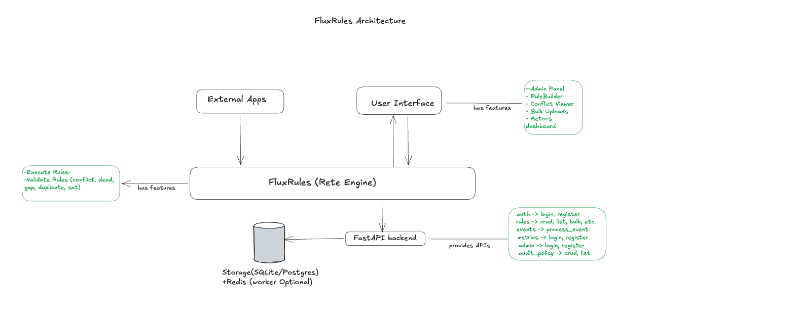

[](LICENSE)
[](https://www.python.org/)
[](https://fastapi.tiangolo.com/)
[](https://react.dev/)
[](https://www.typescriptlang.org/)

<div align="center">

# FluxRules
**A light-weight Business Rule Engine.**  
<br/>

</div>

---

## Features

| Category | Highlights |
|---|---|
| **RETE Engine** | Alpha/beta node network for O(1) incremental pattern matching with local caching and built-in profiler |
| **DSL Parser** | JSON condition trees with AND/OR nesting and 14 operators (`eq`, `neq`, `gt`, `lt`, `gte`, `lte`, `in`, `not_in`, `contains`, `not_contains`, `starts_with`, `ends_with`, `between`, `regex`) |
| **BRMS Validation** | SAT-solver-backed conflict, dead-rule, gap, redundancy, duplicate, and priority-collision detection |
| **Rule Versioning** | Every edit creates an immutable snapshot; full diff support with field-level change tracking |
| **Analytics** | Runtime metrics, hot/cold rule detection, coverage reports, and per-rule explanation feeds |
| **Dependency Graph** | Visual field-based dependency analysis with summary diagnostics |
| **Audit System** | HMAC-SHA256 tamper-proof audit trail, configurable retention, and cron-based scheduled audit policies |
| **Admin Panel** | Schema version tracking, DB health, engine stats, cache management, bulk import (CSV/XLSX/JSON) |
| **Authentication** | JWT-based auth with OWASP-aligned password policy and admin seed control |
| **Graceful Degradation** | Redis optional (falls back to in-memory); Postgres optional (falls back to SQLite) |
| **React UI** | Vite + React 18 + TypeScript · Tailwind CSS · shadcn/ui · TanStack Query · Dark mode |

---

## Architecture

### System Overview



### Component Breakdown

| Layer | What it does |
|---|---|
| **RETE Network** | Alpha nodes test individual conditions; beta nodes join across rules — O(1) incremental matching |
| **DSL Parser** | Translates JSON condition trees (AND/OR, 14 operators) into RETE nodes |
| **BRMS Validation** | SAT-solver-backed conflict, dead-rule, gap, redundancy, and duplicate detection |
| **Execution** | Priority-ordered agenda, working memory, and async event processing via `POST /api/v1/event` |
| **Versioning** | Every rule edit creates an immutable version with full diff support |
| **Audit** | HMAC-integrity audit trail with configurable retention and cron-based policy scheduling |
| **Frontend** | Vite + React 18 + TypeScript SPA served via Nginx in production |

---

## Quick Start

### Prerequisites

| Tool | Required | Notes |
|---|---|---|
| **Docker & Docker Compose** | Recommended | Easiest way to run everything |
| **Python 3.11+** + [uv](https://docs.astral.sh/uv/) | For local dev | Backend dependency manager |
| **Node.js 18+** + npm | For local dev | Frontend build toolchain |

### Option A — One-time setup (local dev)

```bash
# Clone and enter the project
git clone https://github.com/your-org/fluxrules.git
cd fluxrules

# Run the setup script (installs backend + frontend deps, runs tests)
chmod +x setup.sh run.sh
./setup.sh
```

Then start the development stack:

```bash
./run.sh                 # API on :8000 + frontend dev server on :5173 (hot reload)
./run.sh api             # Backend only
./run.sh frontend        # Frontend dev server only
./run.sh build           # Production frontend build → frontend/dist/
```

### Option B — Docker Compose (recommended for production)

```bash
cp .env.example backend/.env   # review and adjust secrets
docker-compose up --build
```

```bash
./run.sh docker          # shortcut for the above
```

### Service URLs

| Mode | Service | URL |
|---|---|---|
| **Dev** | Frontend (Vite HMR) | http://localhost:5173 |
| **Dev** | API | http://localhost:8000 |
| **Dev** | Swagger UI | http://localhost:8000/docs |
| **Docker** | Frontend (Nginx) | http://localhost:8080 |
| **Docker** | API | http://localhost:8000 |
| **Docker** | Swagger UI | http://localhost:8000/docs |

> ⚠️ **Production:** Generate a strong `SECRET_KEY` (≥ 32 chars) and set `FLUXRULES_ENV=production` in `backend/.env`. See [`.env.example`](.env.example).

---

## Project Structure

```
fluxrules/
├── backend/                    # FastAPI application
│   ├── app/
│   │   ├── api/routes/         # FastAPI route handlers
│   │   ├── analytics/          # Runtime analytics, coverage, explainability
│   │   ├── compiler/           # Rule compilation
│   │   ├── engine/             # RETE network, DSL parser, dependency graph
│   │   ├── execution/          # Agenda, scheduler, working memory
│   │   ├── models/             # SQLAlchemy ORM models
│   │   ├── schemas/            # Pydantic request/response schemas
│   │   ├── services/           # Business logic (rules, auth, BRMS, audit)
│   │   ├── utils/              # Redis client, Prometheus metrics
│   │   ├── validation/         # SAT validation, conflict/dead/gap detection
│   │   └── workers/            # Background event & validation workers
│   ├── migrations/             # Alembic database migrations
│   ├── simulation/             # Sample integration scripts
│   ├── tests/                  # Pytest test suite (226+ tests)
│   └── docs/                   # MkDocs documentation source
├── frontend/                   # React 18 + TypeScript SPA (Vite)
│   ├── src/
│   │   ├── api/                # Typed Axios client modules
│   │   ├── components/         # Reusable UI (layout, rules, admin, shadcn/ui)
│   │   ├── hooks/              # Custom React hooks
│   │   ├── pages/              # Route-level page components
│   │   ├── store/              # Zustand state (auth, dark mode)
│   │   └── types/              # TypeScript interfaces
│   ├── public/                 # Static assets
│   ├── Dockerfile              # Multi-stage build → Nginx
│   ├── nginx.conf              # SPA fallback + API proxy
│   ├── vite.config.ts          # Dev proxy → :8000
│   └── package.json
├── docs/
│   └── images/                 # Architecture diagrams (bre.png, fluxrules.png)
├── .env.example                # Configuration template
├── docker-compose.yml          # Full-stack Docker setup
├── run.sh                      # Dev runner (api / frontend / docker / build)
├── setup.sh                    # One-time project setup
├── mkdocs.yml                  # Documentation site config
├── CONTRIBUTING.md
└── LICENSE
```

---

## API Overview

### Integration Flow

```
1. Authenticate   →  POST /api/v1/auth/token          (receive JWT)
2. Manage rules   →  CRUD /api/v1/rules                (+ /validate)
3. Send events    →  POST /api/v1/event                (runtime evaluation)
4. Read outcomes  →  GET  /api/v1/analytics/*
```

### Endpoint Groups

| Group | Endpoints | Description |
|---|---|---|
| **Auth** | `POST /auth/token`, `POST /auth/register` | JWT authentication |
| **Rules** | CRUD `/rules`, `/rules/validate`, `/rules/simulate` | Rule management & validation |
| **Events** | `POST /event` | Runtime event evaluation |
| **Analytics** | `/analytics/runtime`, `/analytics/rules/top`, `/analytics/coverage`, `/analytics/explanations` | Observability |
| **Dependency Graph** | `GET /rules/graph/summary` | Field-based dependency analysis |
| **Conflicts** | `GET /rules/conflicts/detect`, CRUD `/rules/conflicts/parked` | Conflict detection & management |
| **Admin** | `/admin/schema`, `/admin/db/health`, `/admin/audit/*` | System administration |
| **Audit Policies** | CRUD `/admin/audit-policy`, `/admin/audit-run`, `/admin/audit-report` | Scheduled audits |
| **Bulk Import** | `POST /rules/bulk`, `POST /rules/bulk/async` | CSV / XLSX / JSON import |
| **Engine** | `/rules/engine/stats`, `/rules/engine/invalidate-cache`, `/rules/reload` | Engine management |
| **Health** | `GET /health` | Liveness probe |

Full interactive docs at `/docs` (Swagger UI) and `/redoc` when the server is running.

---

## 📊 Analytics & Explainability

```
GET /api/v1/analytics/runtime          → coverage %, hot/cold rules, recent events
GET /api/v1/analytics/rules/top        → top-fired and never-fired rules
GET /api/v1/analytics/rules/{rule_id}  → per-rule runtime detail
GET /api/v1/analytics/explanations     → explainability event stream
GET /api/v1/analytics/coverage         → full coverage report
```

---

## Audit Log Integrity

Every operation is recorded in an **append-only audit trail** signed with **HMAC-SHA256**.

| Variable | Default | Description |
|---|---|---|
| `AUDIT_INTEGRITY_ENABLED` | `true` | Stamp new rows with HMAC hashes |
| `AUDIT_RETENTION_DAYS` | `0` (disabled) | Auto-purge entries older than N days |
| `AUDIT_SCHEDULER_ENABLED` | `false` | Enable cron-based scheduled sweeps |

> Rotating `SECRET_KEY` invalidates existing hashes — expected behaviour, not a bug.

---

## 🗄 Schema Versioning

On startup, FluxRules compares the **expected schema version** (in code) against the **recorded version** (in the database). A mismatch blocks startup.

```bash
cd backend && alembic upgrade head   # apply pending migrations
```

---

## Testing

```bash
cd backend

# Full suite
uv run pytest

# With coverage
uv run pytest --cov=app --cov-report=term-missing

# Specific file or keyword
uv run pytest tests/test_rete_engine.py
uv run pytest -k "conflict"
```

---

## Configuration Reference

All config is via environment variables or `backend/.env`. See [`.env.example`](.env.example) for the full list.

| Variable | Default | Description |
|---|---|---|
| `DATABASE_URL` | `sqlite:///./rule_engine.db` | Database connection (SQLite or PostgreSQL) |
| `REDIS_HOST` / `REDIS_PORT` | `localhost` / `6379` | Redis (optional) |
| `SECRET_KEY` | *(must change)* | JWT signing key (≥ 32 chars in production) |
| `FLUXRULES_ENV` | `development` | `development` or `production` |
| `CORS_ALLOWED_ORIGINS` | `*` | Comma-separated allowed origins |
| `SERVE_FRONTEND` | `true` | Serve static frontend via FastAPI |
| `DB_FALLBACK_ENABLED` | `true` | Fall back to SQLite if primary DB unavailable |
| `AUDIT_SCHEDULER_ENABLED` | `false` | Enable cron-based audit policies |

---

## Documentation

```bash
pip install mkdocs mkdocs-material mkdocstrings[python]
mkdocs serve   # → http://127.0.0.1:8000
```

Additional guides are in `backend/docs/`.

---

## Contributing

Contributions are welcome! Please read [CONTRIBUTING.md](CONTRIBUTING.md) for development setup, coding standards, and the pull request process.

---

## License

FluxRules is open-source software licensed under the [MIT License](LICENSE).
